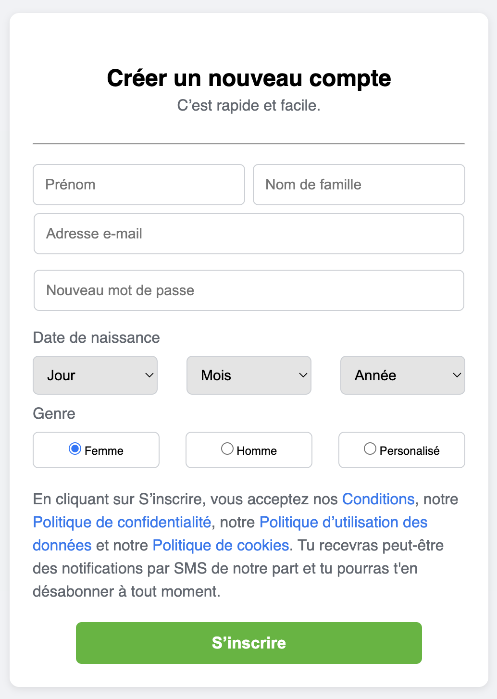

# Formulaire d'inscription Facebook - Projet Codeloccol

Ce projet est une reproduction simplifiée du formulaire d'inscription de Facebook, réalisée en HTML et CSS dans le cadre d'un exercice Codeloccol.

## Fonctionnalités

- Formulaire d'inscription avec :
  - Prénom et nom de famille
  - Adresse e-mail
  - Mot de passe
  - Sélection de la date de naissance (jour, mois, année)
  - Sélection du genre via un menu déroulant
- Mise en page responsive adaptée à tous les écrans (mobile, tablette, desktop)
- Design inspiré de Facebook

## Structure du projet

- `Index.html` : la page principale contenant le formulaire
- `style.css` : la feuille de style pour la mise en forme et la responsivité

## Aperçu

Le formulaire est centré à l'écran, avec des champs bien espacés et une interface claire. Il s'adapte automatiquement à la taille de l'écran pour une expérience utilisateur optimale sur mobile et ordinateur.

## Utilisation

1. Ouvrez le fichier `Index.html` dans votre navigateur.
2. Remplissez les champs du formulaire.
3. Cliquez sur "S’inscrire" pour envoyer le formulaire (aucun traitement côté serveur n'est inclus).

mon experiece est d'avoir eu des nouvelle option sur html est moi qui pensais que tous les commandes son sur le css non je me suis tromper en voyant la balis label
les input pour les bouton les section est au niveau du css je eu l'opportunité de voir d'autres base vraiment fiable qui facilite mis en page d'un sit web  comme le (flex wrap !) 

# ici voici un apperçu de la page

## Auteur

Projet réalisé par [A-karim] dans le cadre de la formation Codeloccol.
